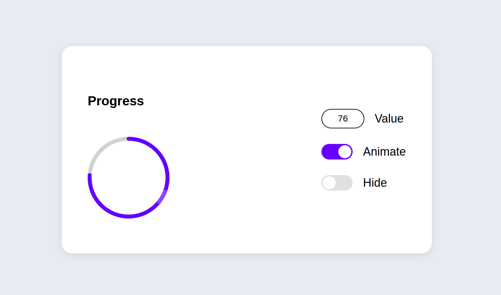
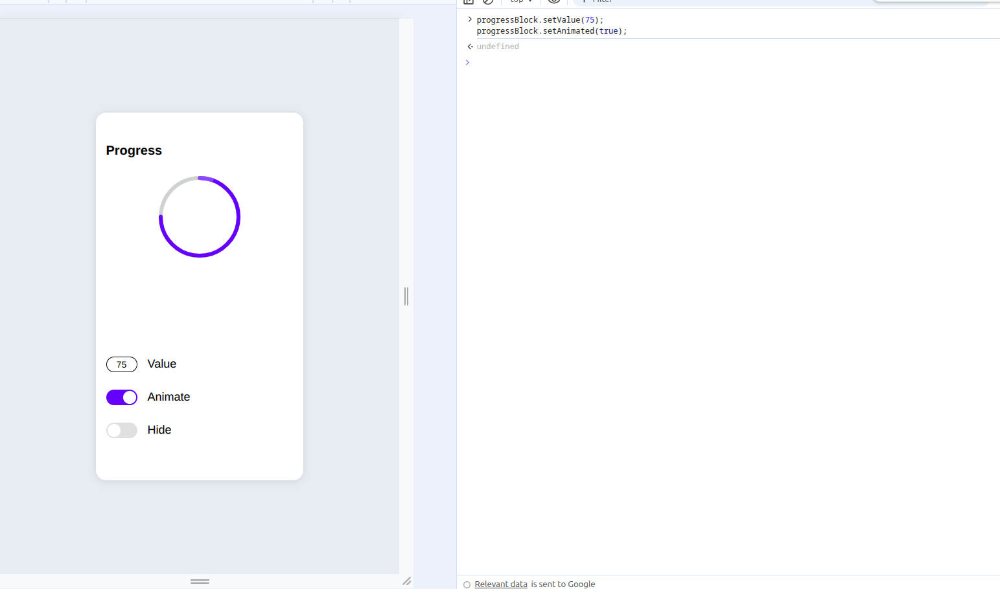
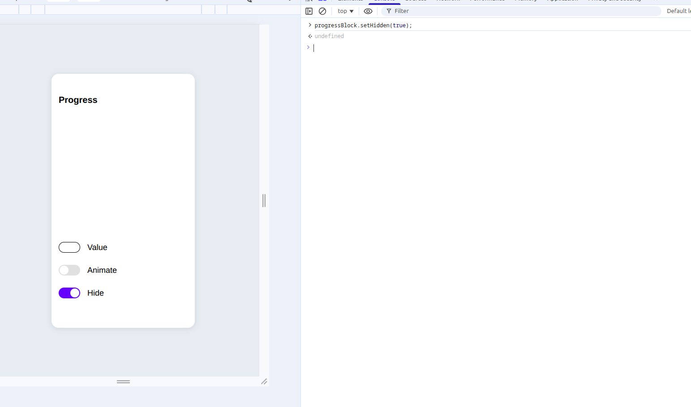
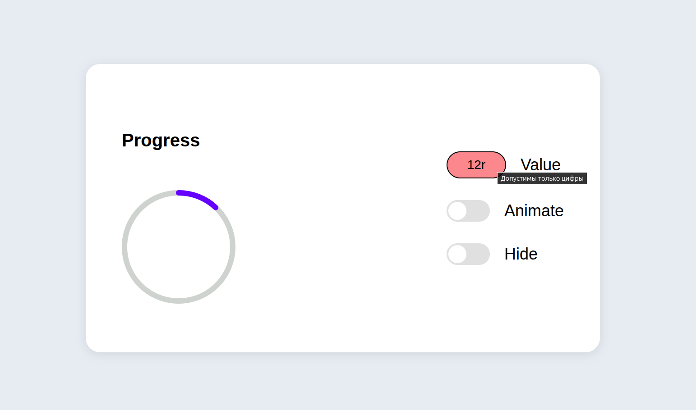

# Progress Circle
```
Открой `index.html` в браузере.
```

## Как работает разметка

 **SVG**: 
   - первый `<circle>` серый, он задаёт фон;
   - второй `<circle class="progress_circle">` — основной прогресс. Стартует с `stroke-dashoffset = 377`, то есть круг пустой, дальше в зависимости от введенного числа, JS уменьшает offset и видно нужный процент(подробней об этом ниже);
   - `<g class="spin-circle">` хранит небольшой "бегунок" с градиентом. Он вращается поверх основного,иммитирую анимацию.

---


## Логика в main.js

1. **getValueInput()** — по сути своей валидатор, он читает строку из поля и проверяет корректность введенных данных (пустое значение, буквы, больше 100).
   Результатом он возвращает стукрутру, через деструктуризацию из нее достаются нужные поля и на этом основании продолжается работа других функций.
   Например:
   - пусто значение — возвращает return {reason: `empty`}
   - всё ок — отдаёт число и флаг `isValid: true`.

2. **Обработчик input** пользуется этим объектом:
   - при любой ошибке выключает анимацию и, если поле пустое, обнуляет прогресс;
   - при валидном значении считает длину дуги `CIRCLE_LENGTH * (1 - value / 100)` и обновляет `strokeDashoffset`, чтобы подсветить часть круга.

3. **Анимация**
   - `startSpinAnimationLoop()`задаёт CSS-переход на `transform` и через 50 мс запускает вращение на нужные градусы, по завершению обнуляет круг и повторяет цикл, пока чекбокс Animate включён и значение валидно;
   - `stopSpinAnimation()` очищает таймеры, делает "бегунок" прозрачным и возвращает его к началу.

4. **progressBlock** — данный объект экспортируется в window, он предоставляет методы `setValue`, `setHidden`, `setAnimated`, `getState`. Через него можно управлять компонентом (например, из консоли или тестов), а внутренняя логика остаётся нетронутой.

---

## Общая картина следующая:

1. Пользователь вводит число.
2. JS проверяет его, вешает/снимает подсветку поля и пересчитывает дугу основного круга.
3. Если значение валидно, можно включить Animate — "бегунок" станет видимым, начнётся цикл вращения.
4. Переключатель Hide просто добавляет/убирает класс `progress__bar--hidden`, поэтому круг исчезает, но логика продолжает следить за значением.

---

## Коротко

- Весь визуал построен на двух SVG-кругах: один показывает процент, второй имитирует бегунок.
- Валидация централизована, поэтому анимация никогда не стартует при неправильном вводе.
- Никаких зависимостей: только HTML, CSS и немного JavaScript.

---

## Скриншоты

<table>
  <tr>
    <td></td>
    <td></td>
  </tr>
  <tr>
    <td></td>
    <td></td>
  </tr>
</table>
