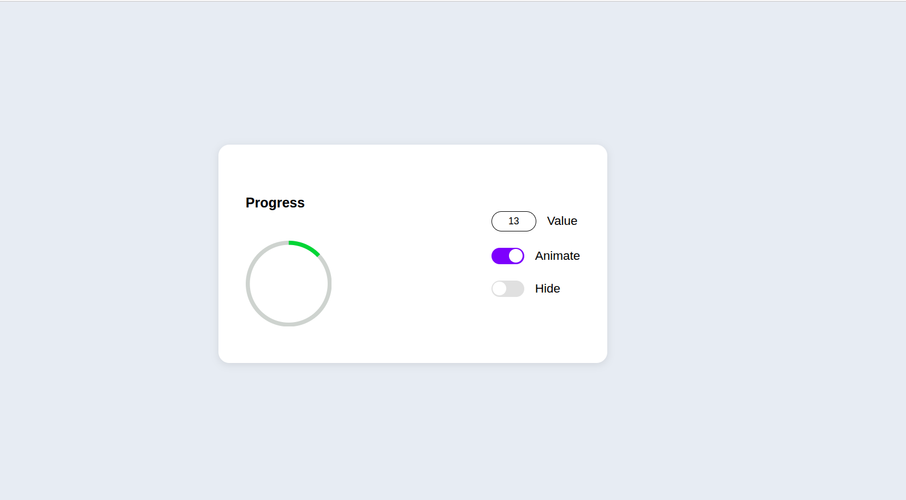
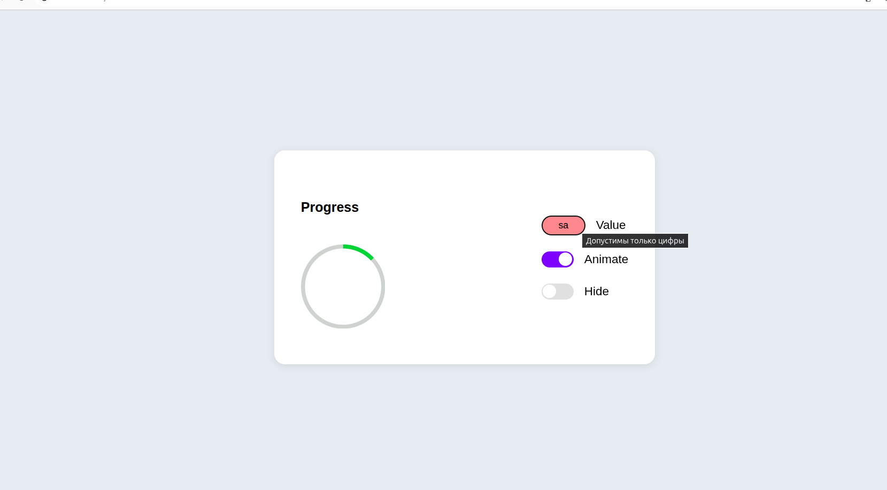

# 📊 Progress Circle UI

Интерактивный компонент **Progress Circle** для мобильного интерфейса **320×568**.  
Реализован на **HTML**, **CSS (БЭМ)**, **JavaScript** и **SVG**.  
Лёгкий, адаптивный и без сторонних библиотек.

---

## ✨ Функционал

- 🔵 Отображение прогресса с помощью **SVG-круга**
- 🔢 Ручной ввод значения **от 0 до 100**
- 💫 Встроенная **пульсирующая анимация ожидания**
- 🎛 Переключатель анимации
- 👁 Возможность скрывать и отображать круг прогресса

---

## 📂 Структура проекта

## 📂 Структура проекта

```bash
project/
├── index.html          # Главная страница
├── css/
│   └── style.css       # Стили (БЭМ)
├── scripts/
│   └── main.js         # Логика работы компонента
└── README.md           # Документация
```
---

## 🚀 Как использовать

1. Склонировать проект или скачать архив.
2. Открыть `index.html` в браузере.
3. Ввести значение прогресса в поле **Value**.
4. Управлять анимацией и видимостью с помощью переключателей.

---

## 🎨 UI / UX

- ✅ Верстка по методологии **БЭМ**
- 📱 **Адаптивный дизайн** (mobile + landscape)
- ⚡ **SVG-анимации** реализованы вручную без библиотек
- 🪶 Лёгкий, быстрый и кроссбраузерный

---

## 🛠 Технологии


---

## 📸 Скриншоты

> 

---

## 📌 Особенности

- **Без зависимостей** — чистый HTML, CSS и JS  
- Полностью **адаптивный** компонент  
- Легко интегрировать в любой проект  

---

